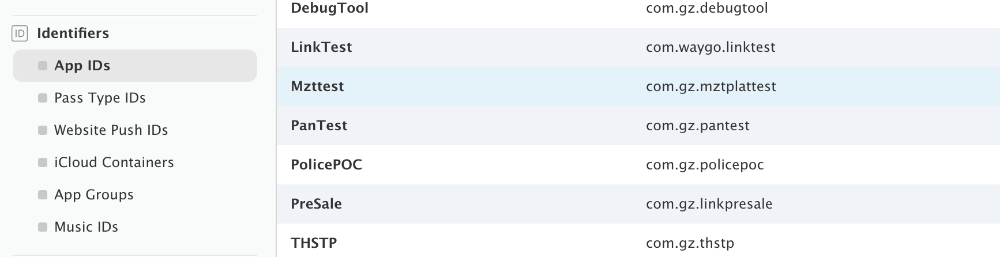
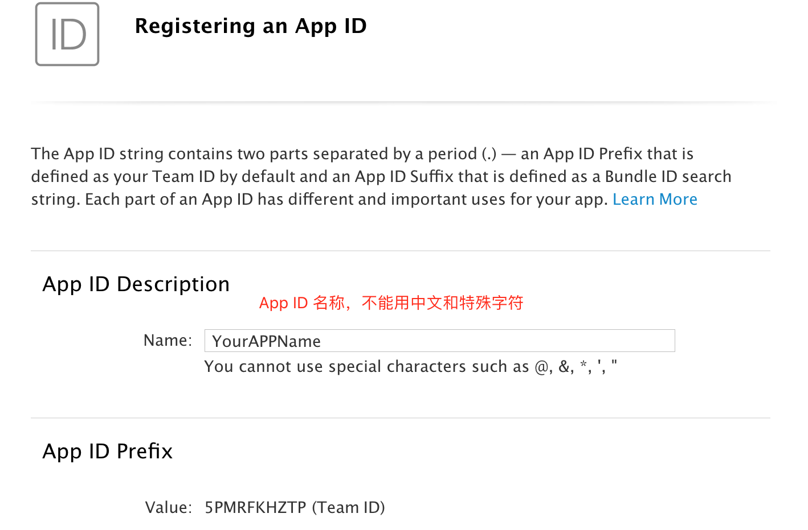
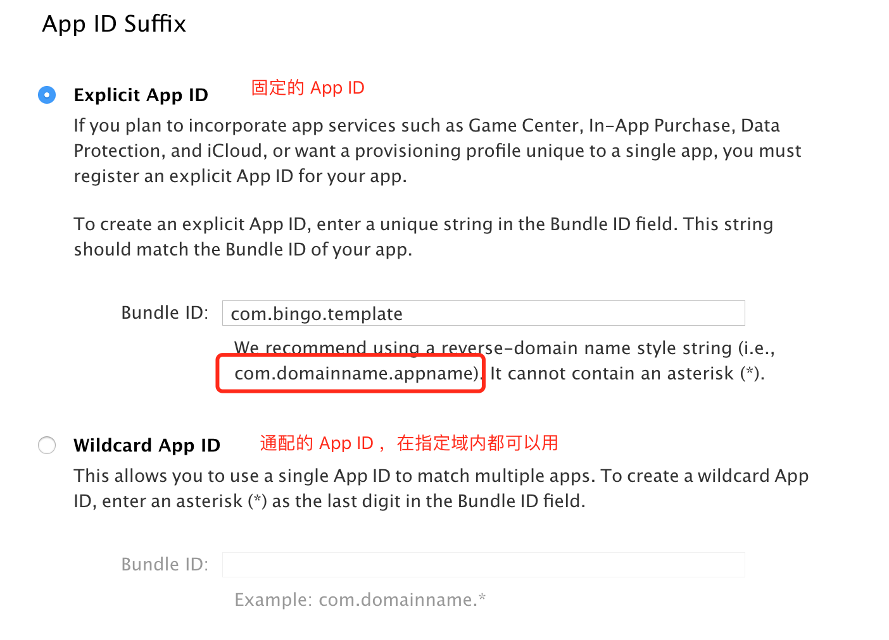
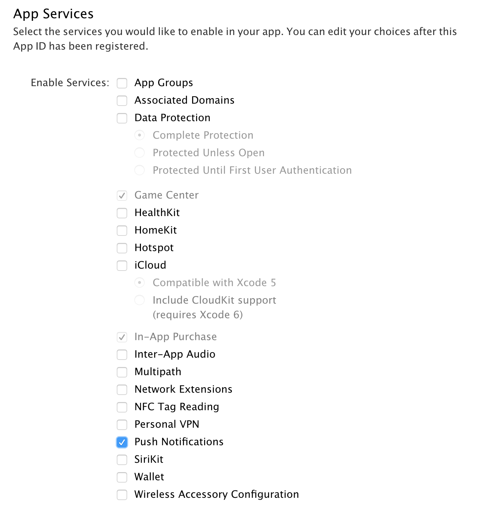

# 应用标识（Identifiers）

应用标识是 iOS 应用的唯一标识。

## 注册App ID

在 iOS 开发中，App ID 也叫 bundle id，注册的时候不能使用中文和特殊字符。

命名建议: com.dommainname.appname (com.域.应用名称）

### 固定App ID
说白了就是一一对应，对于正式发布的应用，通常都是使用这种固定 ID ，因此，它和推送证书，描述文件也是一一对应的。

### 通配App ID

可以使用类似 com.bingo.* 这样的 App ID，只要应用的 bundle id 前缀是 com.bingo，就能够使用相同的描述文件。例如: com.bingo.xx 和 com.bingo.yy。通常在开发阶段，为了避免经常到苹果开发者网站注册应用，企业内部都会内置一个 通配的 App ID。

## 选择服务
对于需要用到 APS 推送的，务必勾选 "Push Notification"
