# 打包证书

证书的作用是证明开发者身份，标识应用的所属。该章节讲述了 【创建证书】【证书安装】等内容。

打包证书分为两种即Distribution和Development两种类型。

**1.Distributon（发布证书）**

用于打包发布应用 ，同一开发者最多只能创建 **2** 个此证书，以【公司名】命名此证书 。

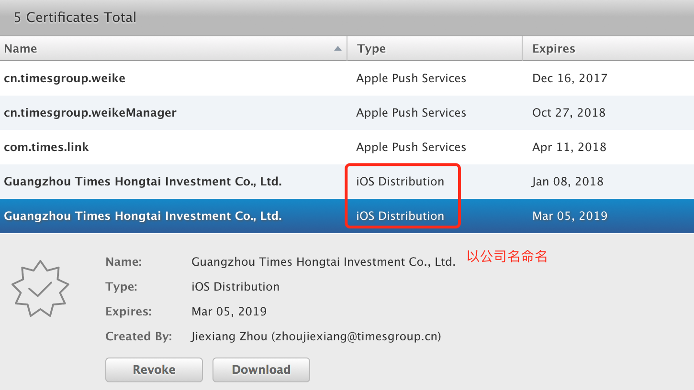

**2.Development（开发证书）**

用于打包开发过程中的应用 ，以`子开发者`名命名此证书，可以有N个。

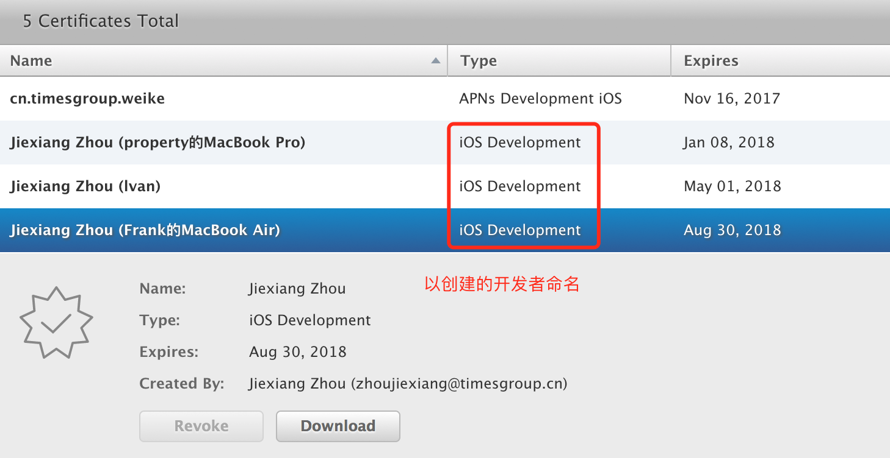

## 创建证书

接下来的操作得在 `Mac OX` 中进行。

### 第一步，生成证书请求文件

操作系统中找到 钥匙串访问(Keychain Access)

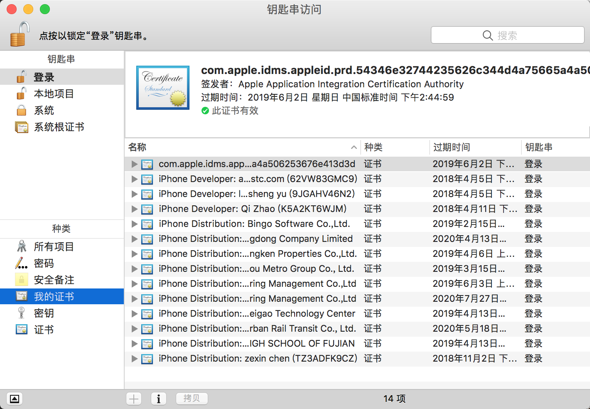

钥匙串访问 > 证书助理 > 从证书颁发机构请求证书

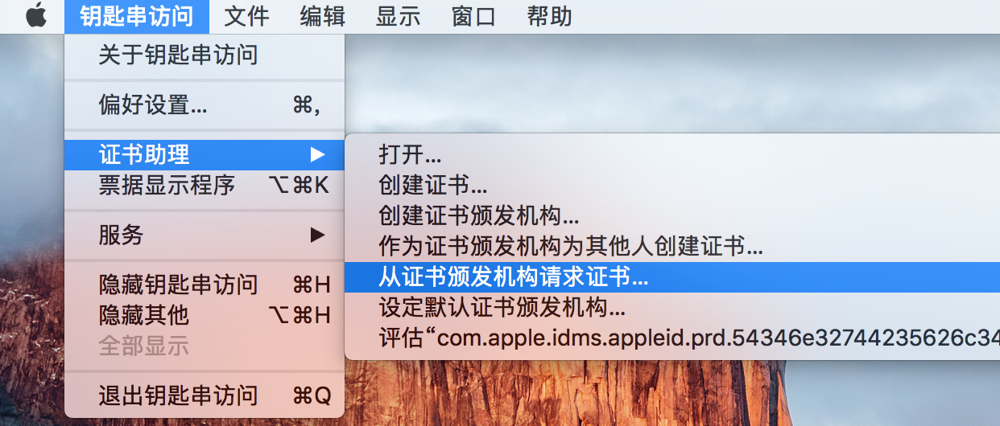

输入邮箱，名称最后存储到本地磁盘上

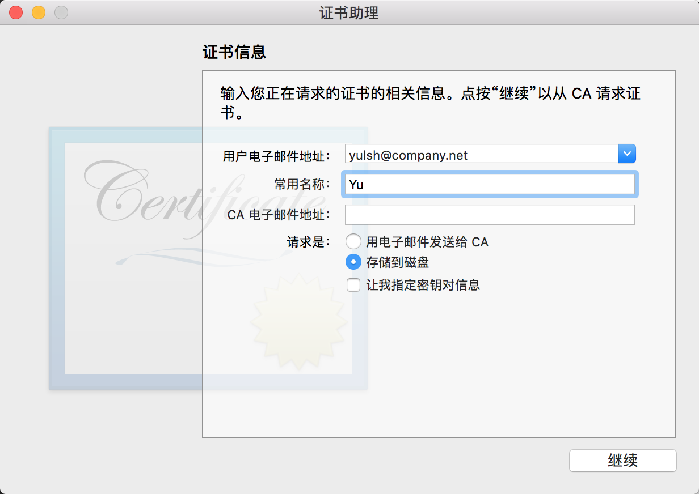

最后得到一个后缀名为: `.certSigningRequest`的CSR文件

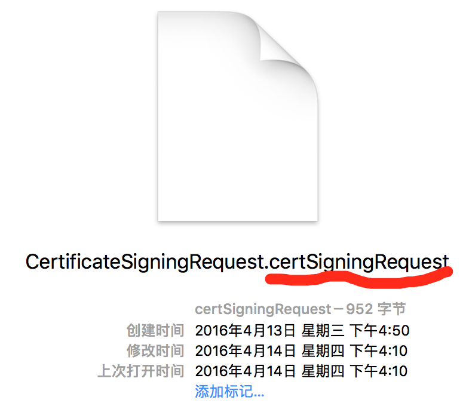

### 第二步，选择证书类型

这里先以生成 Production > In-House and Ad Hoc 的证书为例。其中 In-House and Ad Hoc是企业账号（Enterprise Program）特有的证书类型，用于企业内分发。

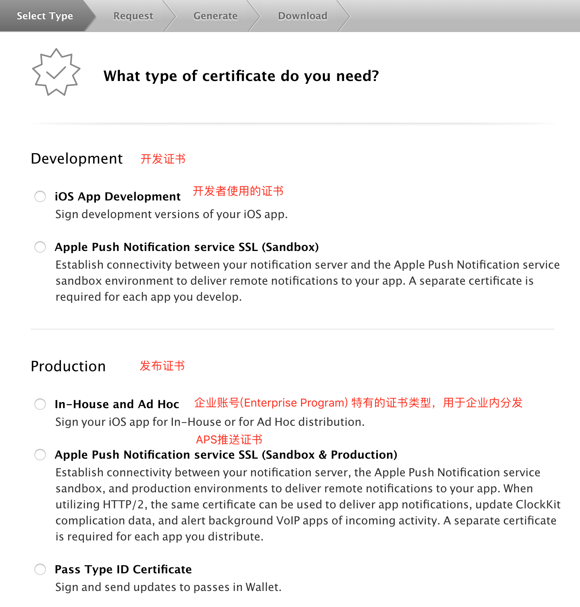

### 第三步，上传证书请求文件（CSR文件）

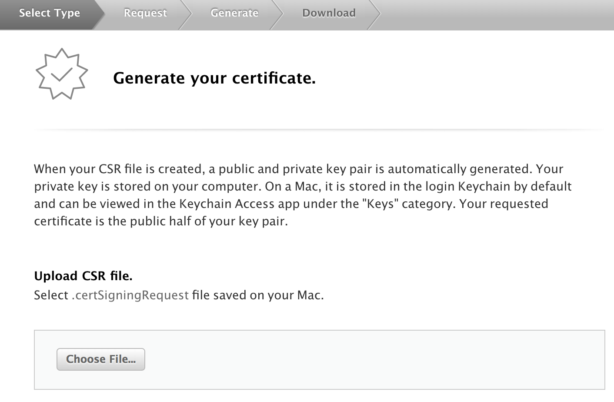

### 第四步，生成证书(CER)

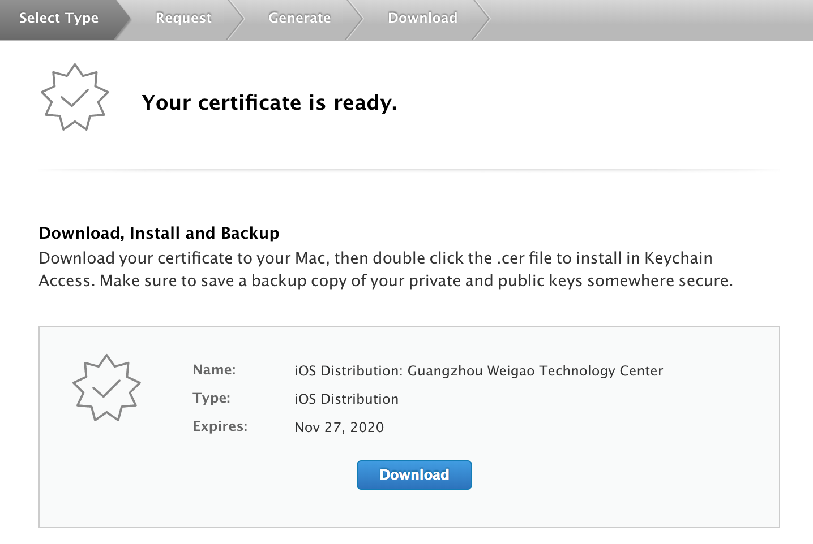

下载下来的是 【ios_distribution.cer】

## 安装证书

双击【ios_distribution.cer】安装在Mac OX 的 KeyChain 里面。该证书安装后是带 【私钥】的。只有带私钥的证书才可以使用，才能导出 p12 文件給其他开发者使用。

注意：把 ios_distribution.cer 传播给其他Mac机器安装，是无法看到私钥的。原因是CSR 来自于不同的机器（来自宿主）。此时其他Mac需要使用，则必须由宿主导出 P12文件。

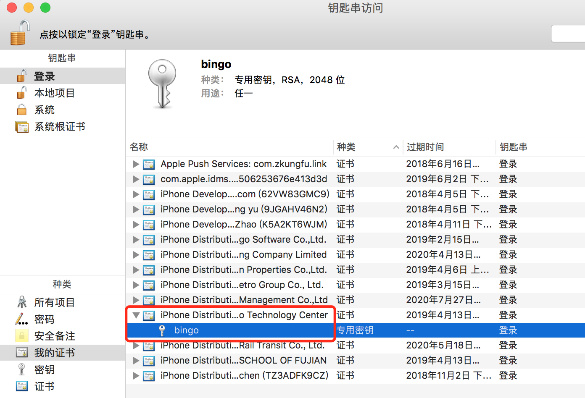

## 导出P12文件
p12文件，用于存放个人证书/私钥,它通常包含保护密码

选择对应的证书，右键导出p12文件，导出的同时设置好密码。

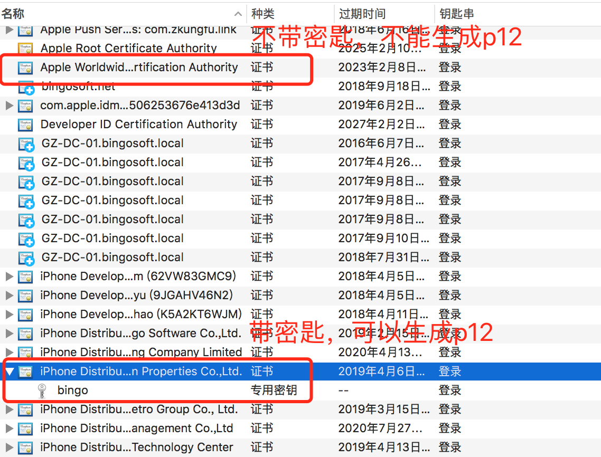

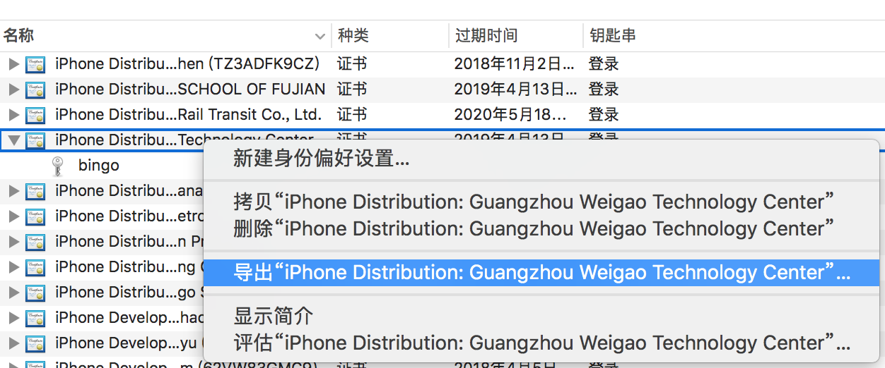

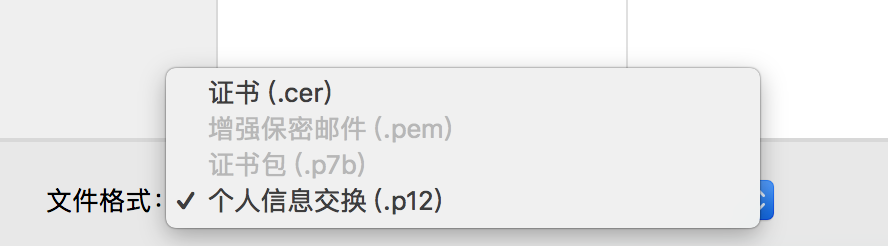

导出 *.p12 文件即可传播给其他开发者。
