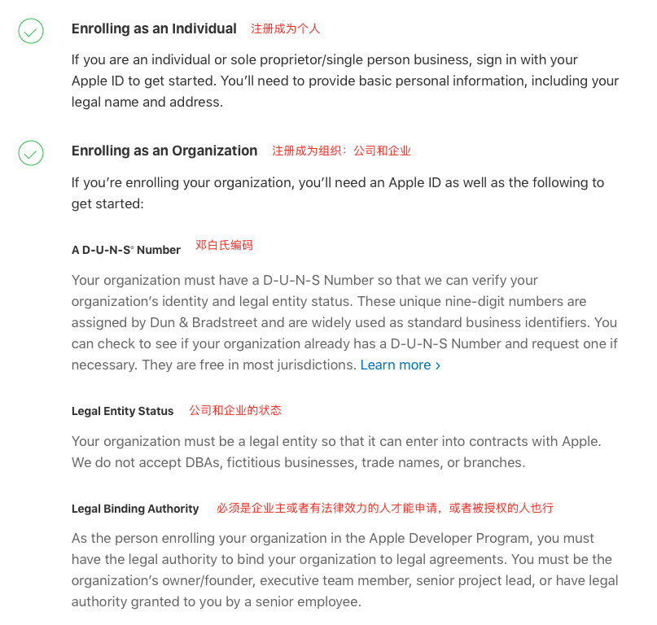
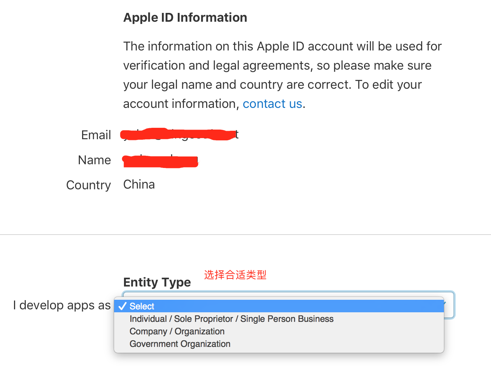
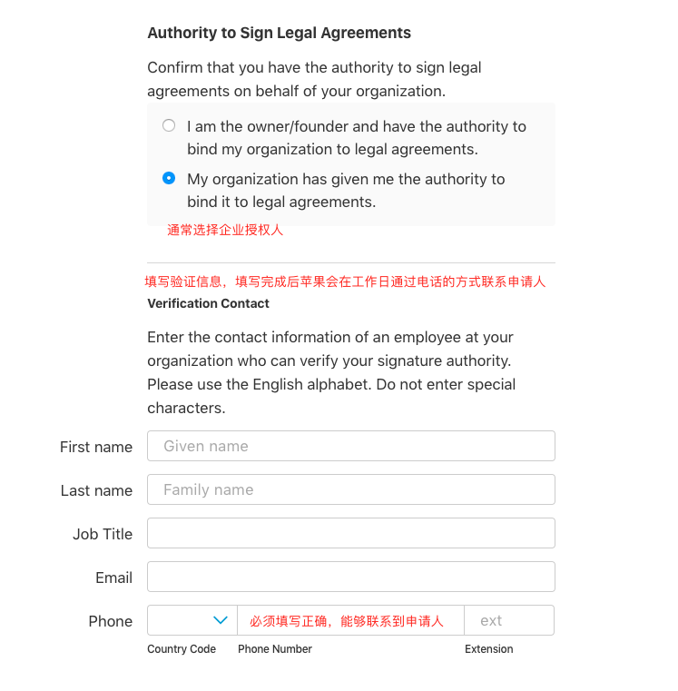
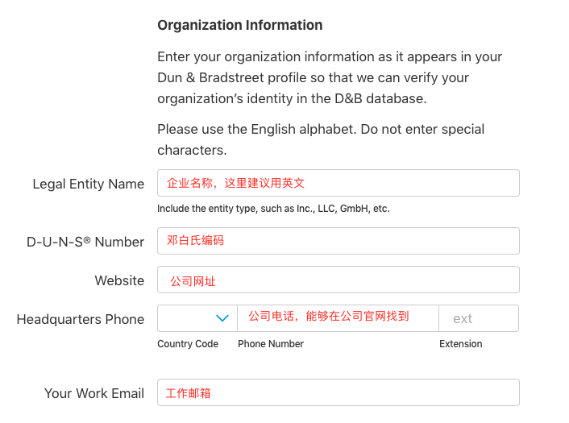

# 开发者账号申请

## 注册Apple ID
在申请开发者账号之前，首先得有Apple ID。对于拥有iOS设备或者Mac设备的人来说，从AppStore上下载应用必须要用到的Account,如果没有，请移步[注册Apple ID](https://appleid.apple.com/account) 。注册之后会得到Apple ID，接下来就可以在AppStore上玩耍了！

## 注册开发者账号

注册地址是：[https://developer.apple.com/programs/enroll/](https://developer.apple.com/programs/enroll/)   注: enroll\(注册\)

其中注册成为组织，需要准备的资料较多。1是邓白氏编码；2是组织的合法信息（负责人或者授权人、经营情况、营业执照等）。必须按照实际情况来填写。

### 选择Entity Type

点击"Enroll Your Enrollment"进入到如下界面：Entity Type的选择有如下三种：

1.Individual/Sole Proprietor/Single Person Business:  个人／个体经营者／独资企业主

2.Company/Organization：公司／组织

3.Government Organization：政府组织（按笔者理解可以是政府机构、公立学校、事业单位等国家的组织）

其中对于2是要求提供D-U-N-S® Number（邓白氏编码），1和3则无需提供。

### 填写申请人信息

请如实填写申请人信息，苹果会在1～2工作日内通过电话的方式验证申请人的合法性。

注意：申请人的电话必须填写正确，否则苹果客服人员可能会联系不上申请人，如果联系不上，开发者可以尝试拨打苹果客服电话去咨询申请的进度。（苹果开发者客服：400 670 1855）

### 填写组织信息

接下来填写组织信息（如下图所示），这里必须要注意，苹果客服人员在电话验证的时候，通常会先去组织官网找组织的信息，例如公司的座机号码，他们会优先拨打网站上找到的号码（通常网站上的座机号码都是公司前台的，建议事先跟前台工作人员打声招呼）

如未得到邓白氏编码，请先看下个章节！

提交完成后，将会得到一个 Enrollment ID,注意保管好这个ID。

### 苹果公司审核

苹果公司将会用电话或者邮件的方式与申请人联系，审核时间长短依据企业情况以及苹果内部审核流程所需要的时间而定，在此期间请注意留意邮箱动态。审核通过后会收到邮件，点击里面的链接进入到付费入口，之后使用VISA或者MASTER信用卡进行付费。付款后需要等待**`2周`**才能创建描述文件。