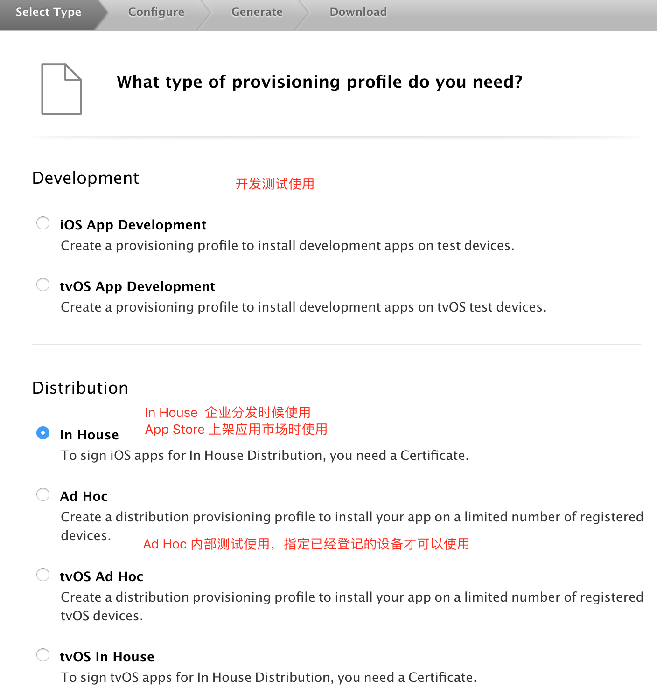
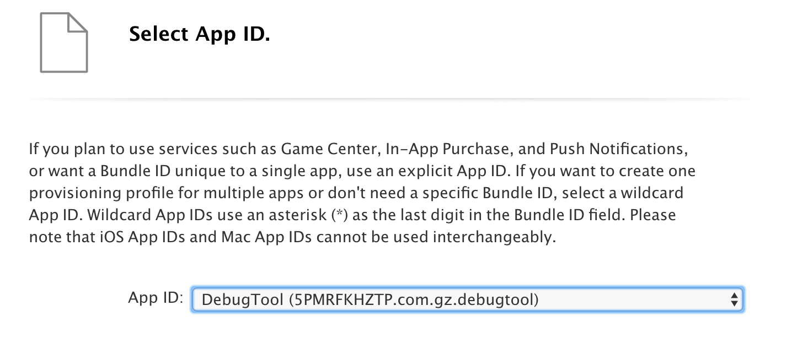
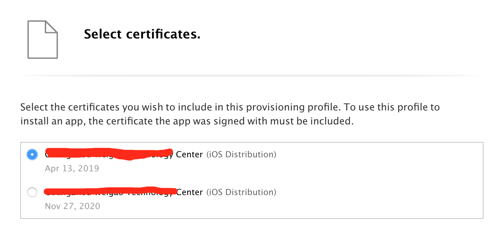
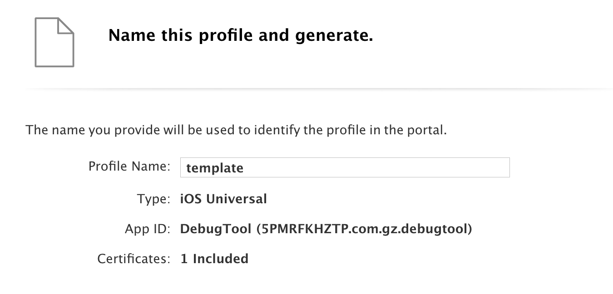
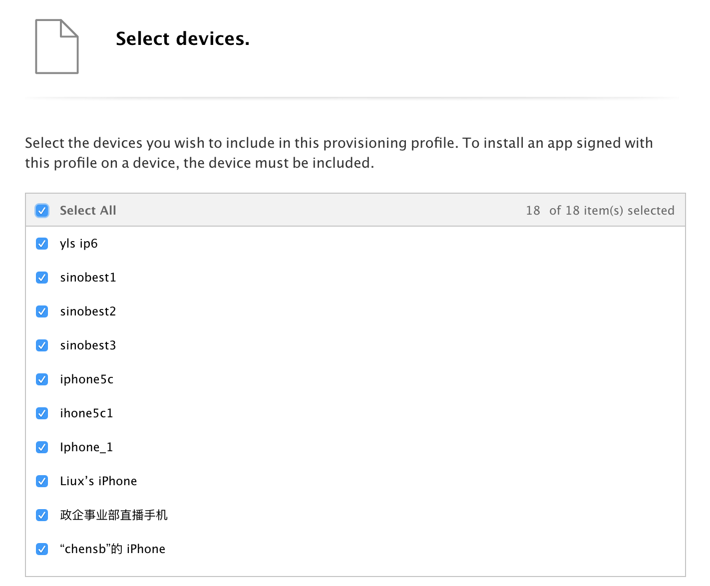

# 描述文件（Provisioning Profiles）

描述文件，将 App ID、证书信息、设备三者绑定在一起。

## 生成描述文件

### 第一步，选择类型
Development : 真机调试时候使用，需要先注册苹果设备（登记UUID），如果是新版本xcode的，在IDE内部可以快速 "Regist device" 。

Distribution : 发布应用时候使用。其中 In Hourse(内部分发), Ad Hoc（局部分发）, App Store（上架市场）。

### 第二步，选择App ID

### 第三步，选择证书

也许就出现多个证书，选择过期时间跟安装在本地KeyChain里面的一致的证书。

### 第四步，填写名称

## 选择设备

如果 Development 类型的描述文件，将需要开发者选择 Devices

