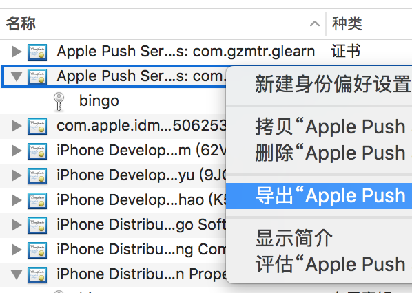
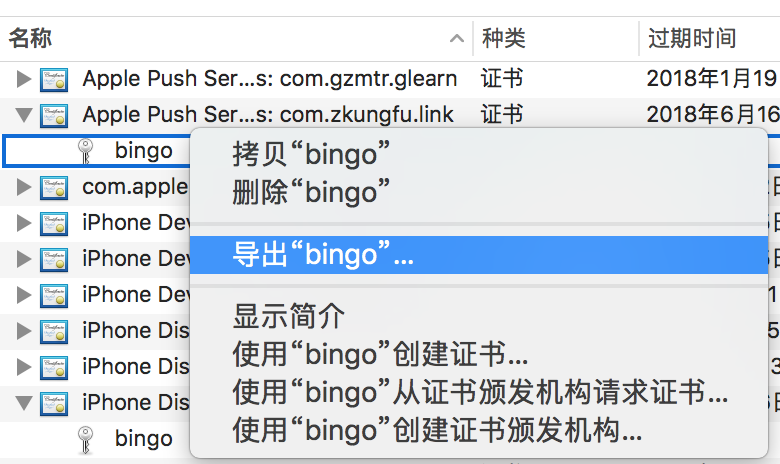
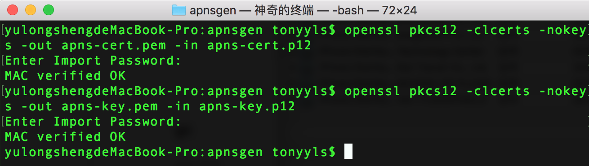

# 推送证书(APS Certificates)

推送证书主要用在推送服务器上，与应用打包和上架无关。分为两种，即 APNs Production 和 APNs Developement 类型。生成推送证书，过程参考 [【打包证书】](./certificates.html)，随后也需要导出p12文件，过程参考 [【打包证书->导出P12文件】](./certificates.html)。

## 生成pem文件

生成 pem 是个繁琐的过程，您可以通过`openssl pkcs12`命令来逐步生成。为了方便开发者，笔者写了个开源工具[【pem-generator】](https://github.com/tonyyls/pem-generator.git)工具来生成。

### 第一步，导出 apns-cert.p12 和 apns-key.p12 

### 第二步，生成pem

需要通过终端命令将p12文件转换为PEM格式：

`openssl pkcs12 -clcerts -nokeys -out apns-cert.pem -in apns-cert.p12`

`openssl pkcs12 -nocerts -out apns-key.pem -in apns-key.p12`

如果想要移除密码，要么在导出/转换时不要设定 或者执行如下命令：

`openssl rsa -in apns-key.pem -out apns-key-noenc.pem`

最后，需要将键和许可文件合成为 apns.pem文件，此文件在连接到苹果APNS时需要使用：

`cat apns-cert.pem apns-key-noenc.pem > apns.pem`

